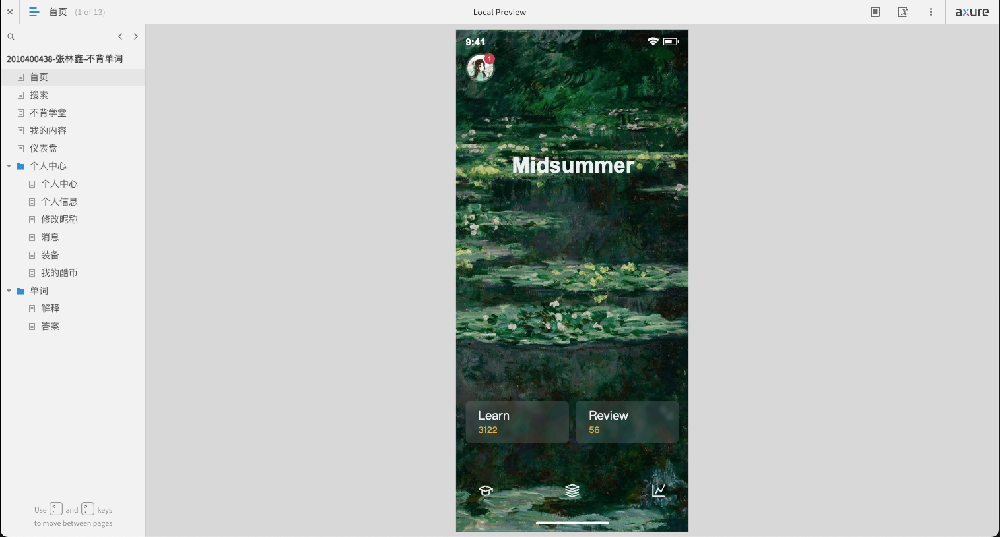

# BuBeiDanCi UI Prototype
English | [中文](./README.zh-CN.md)

The UI prototype design of a mobile application named "BuBeiDanCi" (不背单词) implemented with Axure RP.

## Requirement Specification
This prototype replicates the mobile APP "Unforgettable Words" and implements some of its main pages and key functionalities. The prototype features a UI design and innovative word memorization methods that are different from traditional word memorization apps such as "Baicizhan", keeping up with the times, user-centered, and more in line with contemporary user habits.

## Prototype Functionality Description
As shown in the Axure preview page's directory, this prototype includes the "Home", "Search", "Unforgettable Academy", "My Content", "Dashboard", "Personal Center", "Personal Information", "Change Nickname", "Messages", "Equipment", "My Cool Coins", "Explanation", and "Answer" pages. Their specific functionalities are as follows:
- **Home**: The APP's homepage displays the user's avatar, the screen words, and the number of words learned and reviewed. Clicking on related elements leads to "Personal Center", "Search", "Unforgettable Classroom", "My Content", "Dashboard" pages.
- **Search**: Search for words and display the history of searches.
- **Unforgettable Academy**: Displays the official courses of "Unforgettable Words."
- **My Content**: Displays brief learning data of words.
- **Dashboard**: Displays detailed learning data of words, including current word book learning data.
- **Personal Center**:
  - **Personal Center**: Shows the user's avatar and name and other function entrances. Clicking on related elements leads to "Personal Information", "Messages", "Equipment", and "Cool Coins" pages.
  - **Personal Information**: Displays detailed personal information of the user, such as avatar, nickname, login email, etc. Clicking on related elements leads to "Change Nickname" page.
  - **Change Nickname**: Change the user's nickname in the input box, click the button to confirm the change.
  - **Messages**: Displays various types of messages received by the user, such as system messages.
  - **Equipment**: Displays various types of "equipment" purchased by the user on the APP to assist in learning English.
  - **My Cool Coins**: Displays the points (Cool Coins) the user has obtained on the APP through various ways, such as "Check-in", "First study of the day", etc., and the record of points changes.
- **Words**: Enter the word memorization function.
  - **Answers**: Select the word's answer, click the pronunciation button to make the word pronounce, choose the answer in the answer options. If the answer is correct, you can proceed to the next page "Explanation" to view the detailed explanation of the word. If the choice is wrong, you can continue to select the next option until the correct answer is chosen or click the button to view the answer directly.
  - **Explanation**: Detailed explanation of the word, showing explanations of different parts of speech, such as nouns, verbs, example sentences, and phrase collocations, such as fixed collocations and phrases.

## Prototype Development Description
Replicating an existing APP involves ensuring accuracy in layout, size, color, icons, etc. Since an APP is not a webpage, it's not possible to obtain over 90% of the design information using browser tools as one can with webpages, often relying on visual observation. I used a clever method to obtain some data. For instance, I ran the APP on a mobile device simulator on the PC, then with various design tools like rulers and color pickers, I measured and picked colors on the simulator screen. For icons, it wasn't possible to get the exact ones, so I searched similar icons on icon websites like ByteDance's IconPark, whose official icon library is quite standardized and generally sufficient. Through these operations, along with personal judgment and experience, I preliminarily solved the first-mentioned problem.

After the preparatory work, the replication can be carried out step by step. The process is tedious, but as long as each component is combined and named reasonably to ensure a clear and reasonable page structure, it can be advanced methodically.

The highlight of the prototype is its novel design, user-centric nature, and ease of operation without visual burden.

In the process of prototype design and development, several problems were encountered, such as:
1. The "Home" page's "Learn" and "Review" entries and the background of the "Answer" and "Explanation" pages under the word folder have a blur effect, but as there's no blur effect in Axure, after some research, I found a solution involving running a JavaScript script upon page load to manipulate the style of HTML elements in the preview, but this method is difficult to debug and has compatibility issues, so it wasn't adopted. Ultimately, the blur effect was achieved through basic Photoshop.
2. When the page is too long, meaning scrolling is needed, if the status bar, top operation bar, and bottom mobile operation bar on the page aren't handled, these three elements will scroll and change position with the page. I intended these three elements to be fixed, but initial settings, such as locking positions, didn't work. Eventually, a solution was found by adding a dynamic panel with only one state containing the fixed elements and setting "Fixed to Browser" on the dynamic panel.
3. In designing the "Personal Information" page, the avatar section's design is clever, with the camera icon intersecting the avatar in a notch style. To achieve this effect, I added a circle under the camera icon with the same background color as the page and arranged it above the avatar and below the camera icon, presenting the appearance of the camera icon intruding into the avatar. But the pure camera icon couldn't directly set a background color.
4. On the "Answer" page under the word folder, choosing an answer is a complex operation. When the correct answer is selected, other options can't be selected, and the text of the bottom button changes to "Continue". If an incorrect answer is selected, you can continue to choose an answer or click the bottom button "View Answer" to view the answer until all answers are selected or continued to the correct answer. Each click on different options, along with previous options, can form many states, and the interactions of elements in each state are different. Eventually, 1 "initial state", 7 "wrong answer" states, and 8 "correct answer" states were designed, totaling 16 states to achieve the complete interaction effect of "choosing an answer".
5. After setting global variables, we need to set the page's interaction, such as adding a "Set Text" action when the "page loads", with the value being the global variable. But when executing this operation, the global variable length might be longer than the default value set in the design interface, causing the text box length to increase and position to shift, or in other words, not maintaining alignment. At this point, we need to set the text box width larger than the expected width and finally set the text alignment direction to solve the problem.

## Prototype Operation Instructions
1. First, enter the "Home" page. The top part is the user's avatar, clicking which leads to the "Personal Center" page. Above the bottom menu are entrances for learning and reviewing words, clicking which leads to the word's "

Answer" and "Explanation" pages. The bottom menu sequentially includes entrances to "Unforgettable Academy", "My Content", and "Dashboard". Clicking anywhere else on the page leads to the "Search" page.
2. After entering the "Search" page, the input box allows for word searching, with the bottom part showing the history of word searches.
3. After entering the "Unforgettable Academy" page, scrolling through the page allows viewing the official course list of "Unforgettable Words". Clicking on a course allows for learning. Entering the "My Content" page and clicking on the listen-on-the-go feature activates it. Other parts are brief information about word learning, clicking which leads to detailed pages for viewing information.
4. After entering the "Dashboard" page, you can view the current word book being studied and progress information. You can add matching real question banks and change word books, as well as view learning overview and calendar check-ins, clicking which leads to detailed pages.
5. After entering the "Personal Center" page, clicking the top setting button leads to the settings page. Clicking the avatar leads to the "Personal Information" page, and clicking the "Activate Lifetime VIP" button activates the VIP. Below are various function page entrances, including "Messages", "Equipment", "Cool Coins", and "Coolab" (not yet open).
6. After entering the "Personal Information" page, clicking the avatar allows changing it, clicking the nickname leads to the "Change Nickname" page to change the nickname, and clicking other functions leads to detailed pages for operation.
7. After entering the "Change Nickname" page, entering a new nickname in the input box and clicking the "Confirm Change" button changes the nickname, effective globally for the prototype.
8. After entering the "Messages" page, clicking on a message item leads to the message's detailed page.
9. After entering the "Equipment" page, clicking on various "equipment" leads to activating the corresponding service.
10. After entering the "My Cool Coins" page, you can view the total "Cool Coins" and the detailed changes of "Cool Coins". Clicking the "View Strategy" button allows viewing strategies for obtaining "Cool Coins".
11. After entering the word's "Answer" page, select the answer. After selecting the correct answer, click the bottom "Continue" button to proceed to the "Explanation" page. After selecting the wrong answer, you can continue to select answers, or directly click the "View Answer" button to view the answer.
12. After entering the word's "Explanation" page, you can view the detailed explanation of the word, such as the meanings under different parts of speech, example sentences, and phrase collocations. Clicking leads to detailed pages, and clicking the "Next Time" button continues to the next word's learning, entering the "Answer" page.