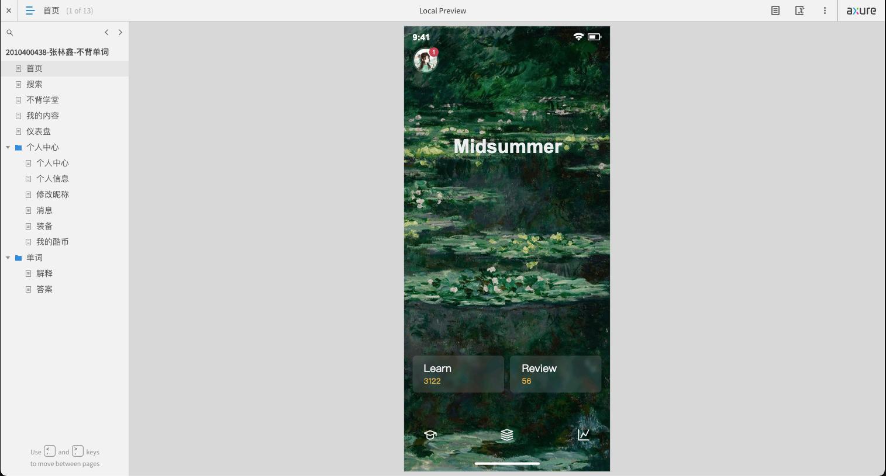

# 不背单词 UI 原型设计
[English](./README.md) | 中文

使用Axure RP实现的移动应用程序“不背单词”的UI原型设计。

## 需求说明
该原型是移动APP”不背单词“的复刻，实现了其部分主要页面及主要功能的设计。原型具有不同于传统背单词APP，如“百词斩”，的UI设计以及新颖的背单词方法，紧跟时代，以用户为中心，更契合当代用户使用习惯。

## 原型功能说明
如下图Axure预览页面的目录所示，该原型有”首页“、”搜索“、”不背学堂“、”我的内容“、”仪表盘“、”个人中心”、“个人信息”、“修改昵称”、“消息”、“装备”、“我的酷币”、”解释“以及”答案“页面。它们体现的功能具体如下：
- 【首页】APP首页，展示用户头像、屏幕单词以及学习复习词数，点击相关元素可进入“个人中心“、”搜索“、”不背课堂“、”我的内容“、”仪表盘“页面
- 【搜索】搜索单词，以及展示历史搜索
- 【不背学堂】展示“不背单词”官方课程
- 【我的内容】展示单词简要学习数据
- 【仪表盘】展示单词详细学习数据，包括当前词书学习数据
- 【个人中心】
  - 【个人中心】展示用户头像和名称以及其他功能入口，点击相关元素可“个人信息”、“消息”、“装备”以及“酷币”页面
  - 【个人信息】展示用户详细个人信息，如用户头像、昵称、登录邮箱等。点击相关元素可进入“修改昵称”页面
  - 【修改昵称】在输入框中修改用户昵称，点击按钮即可确定修改
  - 【消息】展示用户收到的各类消息，如系统消息
  - 【装备】展示用户在APP上购买的各类用于辅助英语学习的“装备”
  - 【我的酷币】展示用户在APP上通过各类方式，如“签到”、“当日首次学习”等获得的积分（酷币）以及积分变动记录
- 【单词】进入背单词功能
  - 【答案】选择单词答案，点击发音按钮可以使单词发音，在答案项中选择答案，若答案正确，则可进入下一页面”解释“，查看单词详细解释，若选择错误，则可继续选择下一项直至选择正确答案，或者点击按钮直接查看答案
  - 【解释】单词的详细解释，展示不同词性的单词解释，如名词，动词解释，展示单词的例句以及词组搭配，如固定搭配和词组。

## 原型开发说明
对一个已有的APP进行复刻，困难在于还原度的把握，包括布局，尺寸，颜色，图标等。因为APP不是网页，不能像网页一样借助浏览器工具获取对设计来说90%以上的信息，很多时候只能靠人眼来观察。这里我采用了一种比较巧妙的方法来获取一些数据，如我一开始提到的。我在PC端使用移动设备模拟器来运行该APP，然后借助各种设计工具，如标尺和颜色拾取工具等对模拟器屏幕进行标定，对颜色进行拾取等操作，至于图标，则无法完全实现相同，只能前往图标网站搜索类似图标作为替代，如字节跳动出品的IconPark，官方图标库很规范且覆盖范围基本够用。通过上述的一系列操作，加上个人判断和经验，初步解决本段第一句提到的问题。

在做好准备工作之后，即可按部就班地进行复刻，过程繁琐，但只要对各个元件进行合理的组合和命名以确保页面结构清晰合理，即可有条不紊的推进。
原型的亮点在于设计新颖，以用户为中心，感官轻松，没有视觉负担，操作简洁明了。
在原型设计开发过程中，遇到了不少问题，如下：
1. “主页”的”Lear“和“Review”入口背景以及单词文件夹下的“答案”和“解释”页面的背景是模糊效果的，但
是由于在Axure中没有模糊效果，进行一番查阅资料之后，找到一个方案，具体是在页面载入时，通过打开链接的形式运行JavaScirpt脚本来操作预览中的Html元素的样式，但是这种方式调试困难且存在兼容性问题，所以最后没有采用。最终通过朴素的方式 - PS处理图片来达到模糊效果。
2. 当页面过长时，也就是说当需要滚动页面的时候，如果不对页面中的状态栏、顶部操作栏以及底部手机操作横条进行处理，那么这三个页面元素会随着页面滚动而滚动改变位置，我的预想是这三个元素是固定位置的，但是一开始通过一系列设置都无法实现效果，如锁定位置等操作。最终通过查阅资料之后找到一个解决方案：增加一个动态面板，动态面板里只设置一个状态，将需要固定的元件放入这个状态中，随后在动态面板上右击设置“固定到浏览器”，即可实现效果。
3. 在设计“个人信息”页时，头像部分的设计很巧妙，相机图标与头像是有相交的，呈现一个缺口的样式，为了实现这个效果，我在相机图标下添加一个圆，背景颜色和页面背景颜色一直，而呈现次序在头像之上，相机图标之下，得以呈现看上去相机图标侵入了头像，造成缺口，但实际上单纯的相机图标是无法直接设置背景颜色。
4. 在单词文件夹下的“答案”页面，选择答案是一个很复杂的操作，当选中正确答案时，其他选项不可选中，底部按钮文本会变为“继续”。而选中错误答案，则可继续选择答案，或点击底部按钮”看答案“查看答案，直至选择完所有答案或继续到正确答案后，其他选项不可进行点击，底部按钮文本变为”继续“。每次点击不同的选项加上先前的选项可以组成很多个状态，每个状态中元素的交互也是不一样的。最终设计了1个“初始状态”，7个“错误答案”状态，8个”正确答案”状态，共16个状态来达到“选择答案”这个功能的完整交互效果。
5. 在设置全局变量之后，我们需要设置页面的交互，如在”页面载入时“添加“设置文本”动作，值为全局变量，但在执行这个操作时，可能出现全局变量长度比我们在设计界面中设置的默认值长，导致该文本框长度增加，位置发生偏移，或者说是没有保持对齐行为。这时，我们需要将文本框的宽度设置为比预期宽度还大，最后设置文本对齐方向，即可解决问题。

## 原型操作说明
1. 首先进入“首页”页面，顶部为用户头像，点击可进入“个人中心”页面，底部菜单上方为单词学习和复习入口，点击可进入单词”答案“和”解释“页面，底部菜单依次为”不背学堂“、”我的内容“、”仪表盘“入口，点击页面的中其他任何地方可进入”搜索“页面。
2. 进入“搜索”页面后，输入框可进行单词搜索，底部为单词历史搜索记录。
3. 进入“不背学堂”页面后，滚动页面可查看“不背单词”官方的课程列表，点击课程可进行学习。进入“我的内容“页面，点击随身听，可开启随身听功能，其他部分是单词学习的概要信息，点击可进入详细页面查看信息。
4. 进入“仪表盘”页面后，可以查看当前学习的词书以及学习进度信息，可以添加配套真题题库以及更换词书，同时也可查看学习概览和日历签到等信息，点击可进入详细页面。
5. 进入“个人中心“页面后，点击顶部设置按钮可进入设置页面，点击头像可进入“个人信息”页面，点击”开通终身大会员“按钮可开通大会员。下方是各个功能页面入口，有“消息”、“装备”、“酷币”、“Coolab”（暂未开放）。
6. 进入“个人信息”页面后，点击头像可进行更换头像，点击昵称可进如“修改昵称”页面进行昵称的更换，点击其他功能可进入详细页面进行操作。
7. 进入“修改昵称”页面后，在输入框中输入新昵称并点击“确认修改”按钮即可修改昵称，对该原型全局有效。
8. 进入“消息”页面后，点击消息项可进入消息详细页面。
9. 进入”装备“页面后，点击各个“装备”即可前往开通相应服务。
10. 进入“我的酷币“页面后，可查看”酷币“总额以及”酷币“变动明细，点击”查看攻略“按钮可查看”酷币“获取攻略
11. 进入单词“答案”页面后，进行答案的选择，选中正确答案后，可点击底部“继续”按钮进入”解释”页面，选中错误答案后，可继续选择答案，或直接点击“看答案”按钮直接查看答案。
12. 进入单词”解释“页面后，可查看单词的详细解释，如不同词性下的释意、例句以及词组搭配，点击即可进入详细页面，点击“下一次”按钮可继续下一个单词的学习，进入“答案”页面。